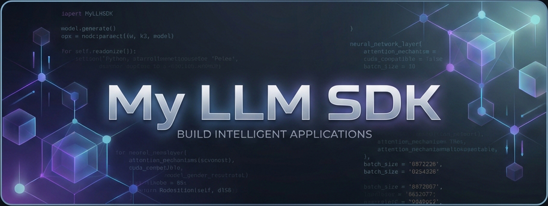

**English** | [中文](README.md)

[](LICENSE)
[](https://www.python.org/)

<p align="center">
  
</p>

# My LLM SDK

**One codebase, multiple models.**

> Call Gemini / Qwen / Doubao / DeepSeek with a single `client.generate()`.  
> Built-in budget control, 429 auto-retry, and usage tracking.

---

## 🚀 Quick Start

```bash
# 1. Install
pip install -e <SDK_PATH>/my-llm-sdk

# 2. Initialize config
python -m my_llm_sdk.cli init

# 3. Edit config.yaml with your API keys

# 4. Generate
python -m my_llm_sdk.cli generate --model gemini-2.5-flash --prompt "Hello"
```

---

## ✨ Features

| Feature | Description |
|:---|:---|
| **Unified API** | Single `client.generate()` for all providers |
| **Multi-Provider** | Gemini, Qwen, Doubao, DeepSeek |
| **Multimodal** | Image Gen / TTS / ASR / Vision |
| **Budget Control** | Pre-request spend check, auto-reject on over-budget |
| **Auto-Retry** | Handles 429 / timeout with exponential backoff |
| **Async + Streaming** | `generate_async` / `stream_async` |

---

## 📚 Provider Guides

| Provider | Capabilities | Docs |
|:---|:---|:---|
| **Google Gemini** | Text / Vision / Image Gen / TTS | [guide/providers/google.md](guide/providers/google.md) |
| **Qwen (DashScope)** | Text / Vision / Image / TTS / ASR | [guide/providers/qwen.md](guide/providers/qwen.md) |
| **Volcengine (Doubao)** | Text / DeepSeek / Image / Video | [guide/providers/volcengine.md](guide/providers/volcengine.md) |

---

## 🔧 Configuration

### config.yaml (Local, do NOT commit)

```yaml
api_keys:
  google: "AIzaSy..."
  dashscope: "sk-..."
  volcengine: "your-key"
daily_spend_limit: 5.0
```

### Modular Config

SDK auto-loads model definitions from `llm.project.d/*.yaml`:

```text
my-project/
├── llm.project.yaml       # Main config
└── llm.project.d/
    ├── google.yaml        # Gemini models
    ├── qwen.yaml          # Qwen models
    └── volcengine.yaml    # Doubao models
```

---

## 📊 CLI Commands

```bash
# Today's usage
python -m my_llm_sdk.cli budget status

# Spending trend
python -m my_llm_sdk.cli budget report --days 7

# Top spenders
python -m my_llm_sdk.cli budget top --by model
```

---

## 🗺️ Roadmap

- [x] Core management and budget enforcement
- [x] Async + Streaming
- [x] Multimodal support (Vision / TTS / ASR / Image Gen)
- [x] Volcengine Provider (Doubao / DeepSeek)
- [x] Reporting CLI
- [ ] Publish to PyPI

---

## 🤝 Contributing

1. Fork this repo
2. Add new Provider in `src/my_llm_sdk/providers/`
3. Submit PR

---

## 📄 License

[Apache 2.0](LICENSE)
