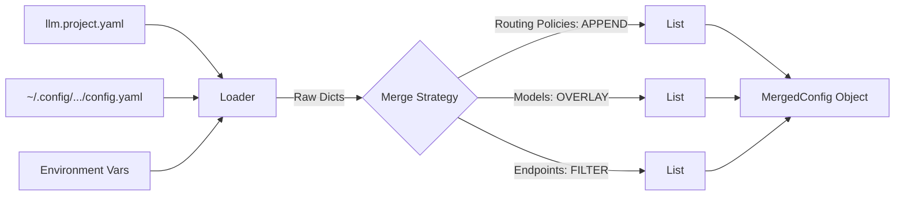
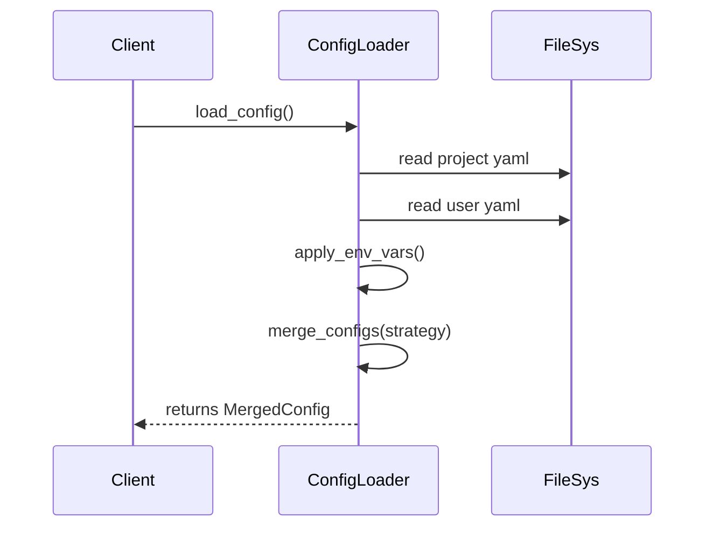

# 模块：配置系统 (Configuration System)

## 1. 模块概述

### 模块目标
实现“双层配置架构”，加载并合并 `ProjectConfig` (Git托管) 和 `UserConfig` (本地私有)，生成运行时唯一的 `MergedConfig` 对象。

### 在项目中的位置
核心基础设施。所有后续模块（Budget, Client, Doctor）都强依赖于 `MergedConfig` 提供的参数。

---

## 2. 依赖关系

### 前置条件
- **前置任务**: 无 (这是第一个模块)
- **输入**: 
  - 文件: `llm.project.yaml` (存在于项目根目录)
  - 文件: `~/.config/llm-sdk/config.yaml` (存在于用户主目录)
  - 环境变量: `LLM_*`

### 后续影响
- **输出**: `MergedConfig` 实例，供 `Client` 初始化和 `Ledger` 检查使用。

---

## 3. 子任务分解

- [ ] plan_02_01 - **定义配置数据模型 (Data Models)** (预估 60min)
  - 简述: 使用 Pydantic 或 dataclass 定义 Config 结构，包含 Validation。
- [ ] plan_02_02 - **实现加载与合并逻辑 (Loader & Merger)** (预估 180min)
  - 简述: 实现 YAML 读取，环境变量覆盖，以及关键的 Merge 策略（Overlay/Append/Filter）。

---

## 4. 可视化输出

### 配置合并流程逻辑

### 接口协作图

---

## 5. 技术方案

### 核心技术选型
- **Pydantic**: 用于数据验证和模型定义（能够处理复杂的嵌套结构和类型检查）。
- **PyYAML**: 用于解析 yaml 文件。

### 合并策略详解 (Critical)
1. **Routing Policies (Append)**: 
   - 项目级策略 `[P1, P2]` + 用户级策略 `[U1, U2]` -> `[P1, P2, U1, U2]`。
   - 理由：项目规则优先，但允许用户追加自用规则。
2. **Model Registry (Overlay)**:
   - 字典/Map合并。Key 相同则项目级覆盖用户级（或者反之？SPEC说是项目级优于用户级定义）。
   - **修正**: SPEC 指出 "项目级定义优于用户级"。若 Project 定义 `gpt-4` 指向 `azure-gpt-4`，User 定义 `gpt-4` 指向 `openai-gpt-4`，应以 Project 为准，确保团队一致性。
3. **Endpoints (Filter)**:
   - User 提供 Endpoints 列表。
   - Project 提供 `data_residency` 规则 (e.g. `allowed_regions: [us, eu]`).
   - 合并时，剔除 User Endpoints 中不符合 Project 规则的节点。

---

## 6. 交付物清单

### 代码文件
- `src/config/models.py`: Pydantic 模型定义。
- `src/config/loader.py`: 加载与合并逻辑实现。
- `src/config/exceptions.py`: `ConfigurationError` 定义。

### 测试文件
- `tests/test_config_merge.py`: 专门测试 Overlay, Append, Filter 三种策略的正确性。

---
